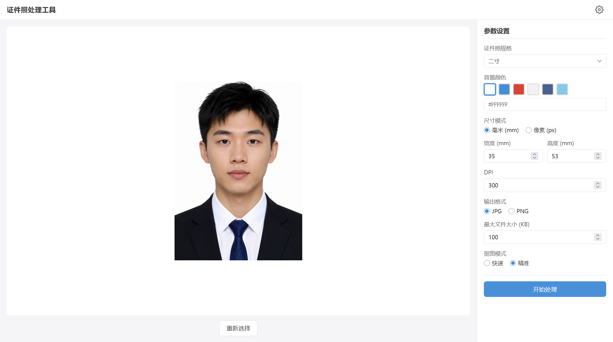

# 证件照处理工具

> 面向日常办证、报名、签证场景的离线优先桌面工具。上传照片，裁剪人像，自动换底色，导出符合常见规格要求的证件照。**示例截图中的证件照由 ChatGPT 生成，不来源于真实用户、公众人物或第三方照片，不涉及任何真实个人的肖像、隐私及相关人格权利。**

<p align="center">
  
</p>

<p align="center">
  <a href="https://github.com/Ysoseri1224/id-photo-edit/releases/tag/v2.0.0"></a>
  
  
  
  
</p>

## 这是什么

`id-photo-edit` 是一个为办公人士、考证报名用户和签证申请用户设计的证件照桌面工具。

它的目标不是做复杂修图，而是把证件照这件事变成清晰、稳定、可控的一次性流程：

- 上传原图
- 裁剪构图
- 自动抠图
- 替换背景
- 导出成品

## v2.0.0 重构目的

`v2.0.0` 的核心目标只有两个：

- 让无技术背景用户尽量少遇到环境问题和下载失败
- 让快速模式与精准模式都走稳定、可控、可复现的处理链

在此前版本里，纯 Node 推理链虽然安装简单，但在不同模型、不同后处理逻辑下很容易出现结果不一致、边缘异常或运行时依赖问题。  
这次重构把抠图链整体收束成更稳定的架构：

- `fast` 与 `precise` 统一改为调用内置 `matting-helper.exe`
- 应用不再依赖系统 Python
- 快速模式开箱即用
- 精准模式只按需下载大模型

## 核心特性

- 常见规格预设
  支持一寸、二寸、中国护照、普通签证、申根签证、高考报名、考研报名、驾照、简历照和自定义尺寸。

- 本地优先处理
  图片裁剪、抠图、换底色、导出均在本地完成，不需要上传原图到第三方网站。

- 双模式抠图
  `快速模式` 内置 `hivision_modnet`，安装后即可使用。  
  `精准模式` 使用 `BiRefNet-general`，首次使用时按需下载模型。

- 统一抠图运行时
  `fast` 和 `precise` 都通过内置的 `matting-helper.exe` 执行，避免系统 Python、端口服务、WASM 内存限制等问题。

- 下载体验优化
  精准模式模型支持多源自动探测与切换，下载进度显示预计剩余时间而不是 MB 计数。

- 导出控制
  支持 `JPG / PNG`，支持像素尺寸输出，支持限制最大文件体积。

## 当前架构

`v2.0.0` 采用以下结构：

- `Electron`：桌面壳、文件系统、资源管理、导出
- `React + Vite`：界面与交互
- `matting-helper.exe`：统一抠图执行器
- `hivision_modnet.onnx`：安装包内置，服务快速模式
- `BiRefNet-general-epoch_244.onnx`：按需下载，服务精准模式

这次重构的关键不是“换了技术栈名字”，而是明确拆分了职责：

- 主应用负责 UI、资源下载、参数管理和导出
- helper 负责抠图推理与模型专属预处理/后处理

这样做的直接收益是：

- 运行路径更短
- 问题定位更清晰
- 用户机器上不需要额外准备 Python
- 快速模式真正做到开箱即用

## 模式说明

- `快速模式`
  内置 `hivision_modnet`，安装后即可用，适合大多数日常证件照处理场景。

- `精准模式`
  使用 `BiRefNet-general`，边缘质量更高，适合头发、肩部轮廓更复杂的照片。首次使用需要下载模型资源。

## 为什么这样设计

很多桌面工具的问题不是“功能少”，而是体验链太脆：

- 依赖系统环境
- 下载链不稳定
- 模型与运行时互相耦合
- 报错难懂

本项目在 `v2.0.0` 里把这些问题作为主要重构目标，而不是附带修补：

- 基础处理组件直接随安装包内置
- 只把真正大的精准模型留给按需下载
- 下载源优先尝试国内公开镜像，再退回国际公开源
- UI 侧继续保留模式管理，但底层运行时统一

## 快速开始

### 环境要求

- Node.js 18+
- Windows
- Python 仅在本地开发和构建 helper 时需要，最终用户使用安装包不需要 Python

### 安装依赖

```bash
npm install
cd frontend && npm install
```

### 启动开发环境

```bash
npm run electron:dev
```

### 构建

构建主应用：

```bash
npm run build
```

构建统一 helper：

```bash
npm run build:matting-helper
```

打包安装程序：

```bash
npm run dist
```

## 项目结构

```text
id-photo-tool/
├─ electron/         # Electron 主进程、资源管理、helper 调用
├─ frontend/         # React 前端
├─ tools/            # matting helper 源码
├─ models/           # 内置模型
├─ dist-electron/    # Electron 编译输出
├─ dist-frontend/    # 前端构建输出
└─ README.md
```

## 版本发布

- baseline 版本：[`v1.0.0`](https://github.com/Ysoseri1224/id-photo-edit/releases/tag/v1.0.0)
- 统一 helper 重构版本：[`v2.0.0`](https://github.com/Ysoseri1224/id-photo-edit/releases/tag/v2.0.0)

## 许可证

MIT
